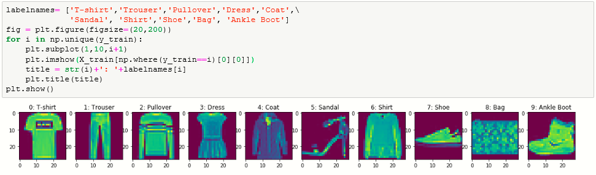
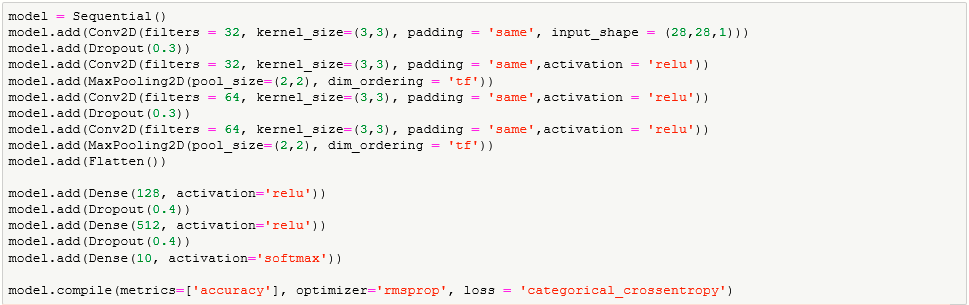

# fashion-mnist-implementation-with-keras
Classification of fashion mnist with Keras

This is a experiment is to classify fashion-MNIST dataset with keras, using a Convolutional Neural Network (CNN) architecture. In just a few lines of code, you can define and train a model that is able to classify the images with over 93% accuracy, even without much optimization.

Fashion-MNIST can be used as drop-in replacement for the original MNIST dataset (10 categories of handwritten digits). It shares the same image size (28x28) and structure of training (60,000) and testing (10,000) splits. It’s great for writing “hello world” tutorials for deep learning.

Keras is popular and well-regarded high-level deep learning API. It’s built right into to TensorFlow — in addition to being an independent open source project. You can write all your usual great Keras programs as you normally would using this tf.keras, with the main change being just the imports. Using tf.keras enables you to take advantage of functionality like eager execution and tf.data — should you like to down the road. Here, I’ll cover basics.

Label Description

0 ----- T-shirt/top\
1 ----- Trouser\
2 ----- Pullover\
3 ----- Dress\
4 ----- Coat\
5 ----- Sandal\
6 ----- Shirt\
7 ----- Sneaker\
8 ----- Bag\
9 ----- Ankle boot\

Dataset of 60,000 28x28 grayscale images of 10 fashion categories, along with a test set of 10,000 images.

### Importing Libraries

  

### loading data
the data has been loaded keras.datasets which are available

  

### Visualizing data
the data has been explored visually to know the different categories available and label are provided as in Keras documentation, and visual interpretation has been used to know number of images for each category.

  
  
  
  

### Expanding the axes to fit 4D Conv model
According to the dataset, the shape of image is (28x28), it was expanded to (28x28x1) here

  

### Scaling the data and converting categorical labels to Continous

  

### Building the model
to study the model, go for model.summary()

  

### Calling the Tensorboard
to configure the Tensorboard

  

### Fitting the model

  

### Evaluating the model
By the result, the accuracy obtained is 93.31% on test dataset and validation loss of 0.2859

  

